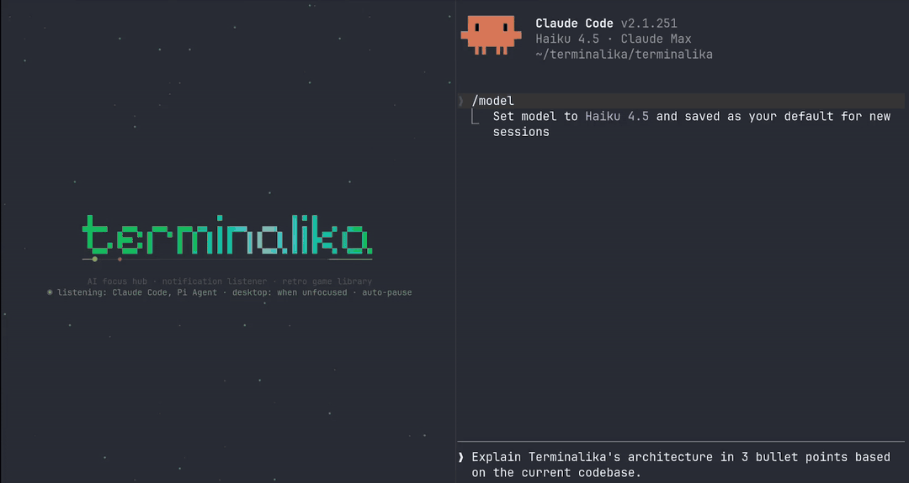

# terminalika

Terminalika is an event-driven focus hub for people who work with CLI AI
agents. It listens to the agents you pick (Claude Code, Pi Agent, Aider,
Cursor CLI), tells you the moment one finishes or needs your input, and
keeps a library of retro games on hand for the wait - pausing whatever
you're playing with a one-line notice that says exactly who wants what.
The games are deliberately easy to drop: the point is to stay in the
terminal for a few-minute wait instead of losing 20 minutes to a browser
tab.



Marketing pitch, install matrix and docs: **[terminalika.dev](https://terminalika.dev)**.
This file is the technical reference for the CLI.

## What's in this repo

| Package                 | Role                                                                                      |
| ----------------------- | ----------------------------------------------------------------------------------------- |
| `main.go`               | Flags, subcommands (`daemon`, `notify`, `setup`, `reset`), the app loop, screen wrapper.  |
| `internal/wizard`       | First-run setup (agents, desktop-notification mode, auto-pause, background process).     |
| `internal/config`       | `config.json` schema v3, load/save, v2 migration.                                        |
| `internal/agents`       | Agent catalogue and the normalised `Event` (`finished` / `input_required`).              |
| `internal/hub`          | Runs every source concurrently, fans events out, dedupes, tracks the one current notice. |
| `internal/sources`      | Builds sources: Claude Code / pi transcript tails, Aider history tail, webhook ingest.    |
| `internal/claudesession`, `internal/pisession`, `internal/aiderhistory` | The native watchers.                                    |
| `internal/webhook`      | Local HTTP ingest (`hub.json`) and the `terminalika notify` client.                       |
| `internal/notify`       | Desktop notifications (`notify-send` / `osascript` / PowerShell) gated by a mode.         |
| `internal/listener`     | Heartbeat seat files: the listener seat (one reacting process) and the daemon seat.       |
| `internal/daemon`       | The headless background process and how a window spawns/stops it.                        |
| `internal/autostart`    | Login registration: XDG autostart, launchd agent, HKCU `Run` key.                        |
| `internal/home`         | Home screen: Pixelify-Sans pixel title, library, fuzzy launch, event toast.                |
| `internal/engine`       | Game loop, global keys, pause/game-over notices, banners, key-release synthesis.          |
| `internal/keystate`     | Kitty keyboard protocol / win32-input-mode key releases.                                 |
| `internal/wsserver`, `internal/sidecar` | Optional WebSocket sidecar and its published address.                     |

The games (Snake, Tetris, Space Invaders, Pong) and the engine contract live
in [`terminalika-core`](https://github.com/terminalika/terminalika-core),
imported as a normal Go dependency.

## Install

Prebuilt packages and binaries (Homebrew, Scoop, `.deb`/`.rpm`/`.pkg.tar.zst`/
`.apk`, raw `tar.gz`/`zip`): **[terminalika.dev/install](https://terminalika.dev/install/)**.

From source (Go 1.24+):

```sh
go install github.com/terminalika/terminalika@latest
```

Windows needs Windows 10+ and a VT-capable terminal (Windows Terminal). See
[RELEASING.md](RELEASING.md) for the release pipeline.

## Run

```sh
terminalika                      # home screen; first run = setup wizard
terminalika setup                # re-run the wizard (also --setup)
terminalika reset                # wipe config.json and start over (also --reset / -r)
terminalika --game=tetris        # skip the home screen (snake, tetris, invaders, pong)
terminalika --agents=claude,aider   # listen to these agents for this run only
terminalika --ws=""              # disable the WebSocket sidecar (default 127.0.0.1:8080)

terminalika daemon               # headless background listener (see "Processes")
terminalika notify --agent cursor --kind input_required   # deliver an event from a hook
```

## Setup wizard

Five steps, all answerable with Enter for the recommended defaults:

1. **Agents** - any of Claude Code, Pi Agent, Aider, Cursor CLI.
2. **Desktop notifications, when?** - `unfocused` (recommended: only while the
   terminalika window doesn't have focus), `always`, `no_window` (only from
   the background process), `never`.
3. **Auto-pause** - freeze the game with a centred notice (recommended), or
   keep playing and show a corner banner.
4. **Background** - keep `terminalika daemon` running from login (recommended).
5. Summary, then save.

There is no in-game "notify or not" switch and no bell: the in-game notice
is always on, and listening to no agents is the way to get silence.

## config.json

`~/.config/terminalika/config.json` (Linux), `~/Library/Application Support/terminalika/`
(macOS), `%AppData%\terminalika\` (Windows); `TERMINALIKA_CONFIG_DIR`
overrides. Schema version 3:

```jsonc
{
  "version": 3,
  "agents": ["claude", "pi"],          // claude, pi, aider, cursor
  "notify": {
    "desktop": "unfocused"             // never | no_window | unfocused | always
  },
  "auto_pause": true,                  // omit = true
  "background": true,                  // run `terminalika daemon` from login
  "webhook": { "disabled": false, "addr": "" },   // ingest; empty addr = 127.0.0.1:7788
  "claude": { "dir": "", "session": "", "message": "" },
  "pi":     { "dir": "", "session": "", "message": "" },
  "aider":  { "dir": "", "history": "" }
}
```

- `notify.desktop` accepts the v2 booleans too: `true` → `always`, `false` →
  `never`. A v2 `notify.bell` is ignored.
- `<agent>.message` replaces the one-line in-game notice for that agent's
  `finished` events (default: *Claude Code's done - you're up.*).
- `<agent>.dir` scopes the watcher to the agent running in that project;
  `session` / `history` pin one file. Legacy `"claude": {"subscribe": true}`
  still enables an agent.
- Runtime files next to it: `scores.json`, `hub.json` (ingest address),
  `ws.json` (sidecar address), `listener.json`, `daemon.json`, `daemon.log`.

## Events

Two kinds, from any source:

| Kind             | Detected by                                                                  | On screen                                            |
| ---------------- | ---------------------------------------------------------------------------- | ---------------------------------------------------- |
| `finished`       | assistant turn with a terminal stop reason (`end_turn`, `stop`); Aider reply | *Claude Code's done - you're up.*                    |
| `input_required` | the turn ends on a question / permission prompt; hook `Notification` events  | *Claude Code has a question - don't leave it hanging.* |

Native watchers tail the agents' own transcript files (`~/.claude/projects`,
`~/.pi/agent/sessions`, `.aider.chat.history.md`); only entries appended
after start count, and subagent transcripts / tool-call turns are ignored.
Anything else posts to the local ingest: `terminalika notify --agent <id>
[--kind ...] [--detail ...]` reads hook JSON on stdin (Claude Code, Cursor)
and infers the kind. The hub drops a repeat of the same agent+kind inside 3 s.

Delivery: with auto-pause on, the running game gets `<game>.pause` with the
notice line and the agent (for its colour); the engine draws it centred and
SPACE resumes. With auto-pause off, a 6-second banner in the top-right
corner. On the home screen, a toast. Whichever screen shows an event marks
it *seen* on the hub (`hub.Current` / `MarkSeen`): one event is shown once,
and never again anywhere - leaving a game after dismissing the notice does
not bring it back as a toast. Desktop notifications go out in parallel
according to `notify.desktop`.

## Processes

Only one terminalika window is open at a time. Every window claims the
**listener seat** (`listener.json`, heartbeat every 2 s, stale after 5 s);
the previous window notices on its next heartbeat and closes itself (the
new window shows a notice saying it did). The seat holder is the one process
reacting to events; it also rewrites `hub.json` so `terminalika notify`
reaches it.

`terminalika daemon` is the headless twin: same hub, same notifier, no
screen. It holds its own **daemon seat** (`daemon.json`; a second daemon
exits at once; deleting the file asks it to stop) and takes the listener
seat only while no window holds it - so it delivers desktop notifications
between windows and from login, and goes quiet the moment a window opens.
With `background: true` a window installs the login entry
(`~/.config/autostart/terminalika.desktop`, `~/Library/LaunchAgents/dev.terminalika.daemon.plist`,
or `HKCU\...\Run\terminalika`), (re)starts the daemon when the wizard saves,
and spawns a missing one on start. `background: false` removes the entry and
stops the daemon.

The `unfocused` notification mode uses terminal focus events (tcell
`EnableFocus`), tracked by a screen wrapper in `main.go`; the daemon counts
as never focused.

## Home screen

The landing screen takes over the terminal and shows an animated title -
the lowercase word *terminalika* in Pixelify Sans, sampled from the font's
own pixel grid and drawn with half-block runes so the pixels come out
square - over a snake chasing its food along the underline. Type to fuzzy-
search a game, Enter to launch, `↓` to reveal the library with previews
and best scores.

## Key releases

Terminals normally only report key presses; holding a key just produces the
terminal's auto-repeat (one event, a pause, then a burst), which makes
continuous movement feel sticky. At start the launcher asks the terminal
(`CSI ? u`, before tcell takes over) whether it speaks the
[kitty keyboard protocol](https://sw.kovidgoyal.net/kitty/keyboard-protocol/).
If it does, tcell's tty is wrapped (`internal/keystate`): the wrapper asks
for the protocol's *report event types* flag, pulls the key release
sequences out of the input stream before tcell sees them, rewrites repeats
into plain presses and re-injects each release as a press of the same key
marked with a Hyper modifier (`keystate.ReleaseMod`), so it goes through
tcell's own queue in order with the presses; the engine turns those back
into releases for games implementing `core.KeyStateHandler`. On Windows,
Windows Terminal's win32-input-mode key-ups are used the same way.

Terminals with real key releases: kitty, foot, Ghostty, Alacritty, WezTerm
(`enable_kitty_keyboard = true`), iTerm2, Konsole, Rio, Windows Terminal;
tmux passes the protocol through with `extended-keys` on. Without support
(GNOME Terminal and other VTE terminals, xterm, Terminal.app) a warning is
shown once at start and the engine synthesises a release ~120 ms after a
key's last press or auto-repeat.

## WebSocket sidecar

`--ws` binds a sidecar (default `127.0.0.1:8080`; a taken port is skipped
forward; the resolved address is written to `ws.json`). Connect to `/`;
both directions are JSON text frames with a top-level `kind`:

```json
{"kind":"list_commands"}
{"kind":"command", "id":"c1", "type":"snake.set_direction", "payload":{"direction":"up"}}
```

```json
{"kind":"command_list", "commands":[{"name":"snake.set_direction", "description":"..."}]}
{"kind":"event", "type":"snake.direction_changed", "game":"snake", "correlation_id":"c1", "payload":{"from":"right","to":"up"}}
{"kind":"error", "code":"unknown_kind", "message":"..."}
```

Failed commands produce `command.rejected` with the command's correlation
id; spontaneous events carry none. `<game>.pause` accepts an optional
`reason` (shown when no `lines` are given) so other clients can pause with
a message of their own.

## Development

`terminalika` depends on `terminalika-core` as a published module. To work
on both, clone them side by side and use a Go workspace (local-only, don't
commit it):

```sh
git clone git@github.com:terminalika/terminalika-core.git
git clone git@github.com:terminalika/terminalika.git
go work init ./terminalika ./terminalika-core
cd terminalika && go build ./... && go test ./...
```

For SSH-only fetching: `git config --global url."git@github.com:".insteadOf "https://github.com/"`
and `go env -w GOPRIVATE=github.com/terminalika/*`.

## Recent changes

- **Notices are one short line**, shown once. The three-line overlay with
  `[SPACE] resume · [ESC] back to menu` and the `[INPUT REQUIRED]` /
  `[AGENT READY]` tags are gone; games no longer append the event to their
  status bar; an event dismissed in a game never resurfaces as a home toast.
- **Bell removed.** Desktop notifications got a *when* instead
  (`notify.desktop`: `never` / `no_window` / `unfocused` / `always`);
  config schema is v3 with automatic v2 mapping.
- **`terminalika daemon`** + `background` setting: login autostart on Linux,
  macOS and Windows; a window spawns a missing daemon and hands it the
  listener seat on exit.
- **One window at a time.** A new window takes over; the previous one
  closes itself. The old "move listening here?" dialog is gone.
- **Home screen title** is lowercase Pixelify Sans; the underline snake has
  a round head, a tongue and a tapered tail.
